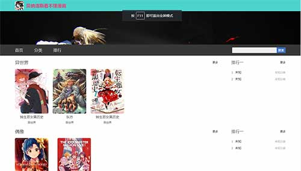
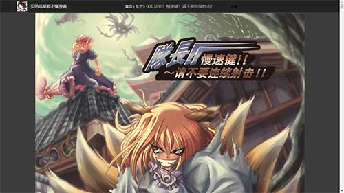

### 目标：koa2实现漫画网站

使用技术栈：koa2 + MySql + nunjucks

#### 现阶段完成

1. 初步完成首页，分类，章节，漫画详情，排行，阅读页的路由和页面结构

2. 根据漫画资源的存储结构获取创建更新数据表信息

#### 未完成：

1. 登录，搜索，评价，上传，推荐系统

2. 数据库结构未定型

### 安装

`git clone git@github.com:wapptaw/node-comic.git`

`npm install`

### 运行

首先创建数据库comicbooks

更新数据库：`npm run updateSql`

运行服务器：`npm run dev`

#### 部分展示

